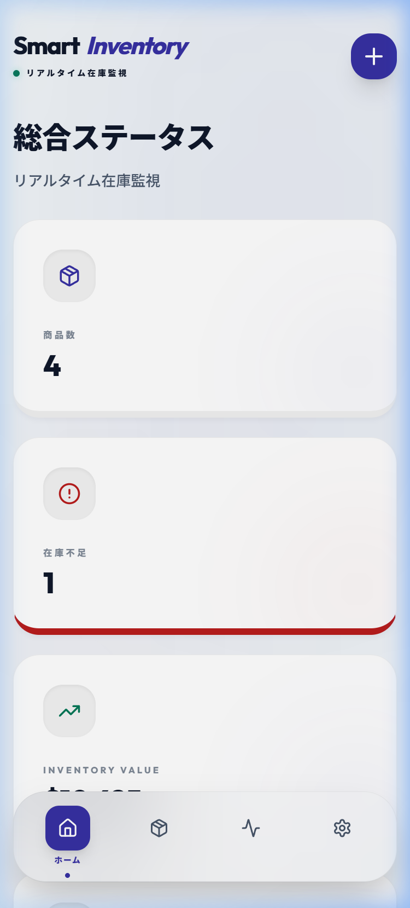
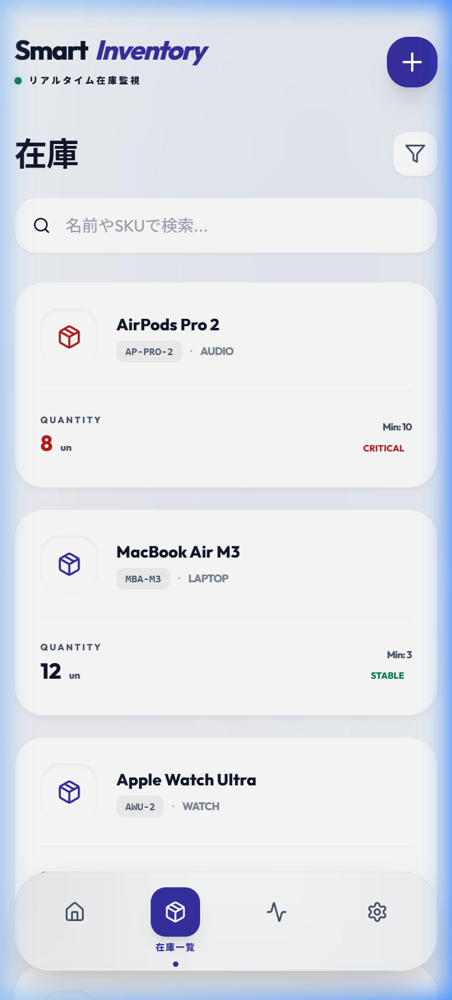
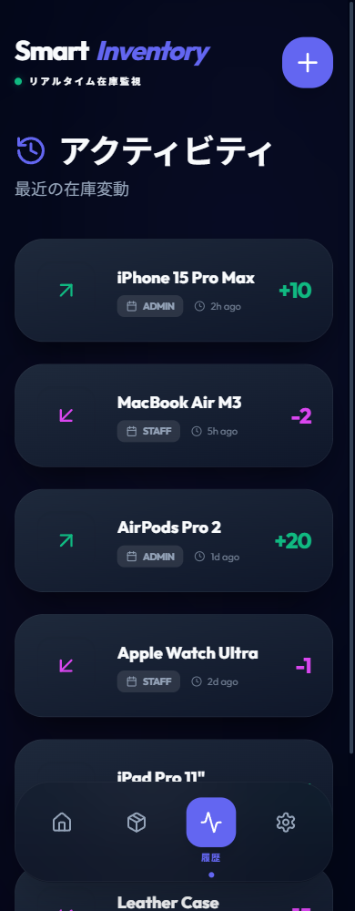

# 📦 Smart Inventory (スマート在庫管理システム)

[](https://opensource.org/licenses/MIT)
[]()
[]()

> **「モバイル・ファースト」と「デスクトップ・プレミアム」を両立した、次世代の在庫管理ソリューション。**
> 
> 現場での素早い操作感と、経営層が必要とするデータ視覚化を一つのアプリで実現。最新のWeb技術（React 18 / Tailwind CSS）を駆使し、あらゆるデバイスで最高のUXを提供します。

---

## ✨ 魅力的で使いやすいインターフェース

Smart Inventoryは単なるデータベースではありません。現場の士気を高める洗練されたデザインと、直感的な操作性を追求しています。

<p align="center">
  
  
  
</p>

---

## 🚀 主な機能

### 🔄 柔軟な入出庫・商品情報更新
単純な入庫だけでなく、**出庫、返品、キャンセル、棚卸（数量検品）**に対応。商品カードをクリックするだけで、数量の増減だけでなく、商品名、カテゴリ、単位、保管場所、状態といった基本情報も同時に更新可能です。

### ⚙️ 現場に合わせた「状態」のカスタマイズ
設定画面から、在庫変動の「状態（ステータス）」を自由に定義可能。業務フローに合わせて名称を変更し、加算・減算・固定（棚卸）の動作を紐付けることができます。

### 📊 リアルタイム・在庫分析
在庫の流動性をリアルタイムでグラフ化。供給フローのトレンドを把握し、欠品リスクの予測や過剰在庫の削減に貢献します。

### 🔔 インテリジェントな在庫アラート
設定した閾値を下回ると、システムが視覚的なアラートで即座に通知。「在庫切れ」による機会損失をゼロにします。

### 📱 究極のモバイル最適化
スマホ画面でも、クリッピング（表示欠け）のない完璧なレスポンシブデザイン。倉庫内を移動しながら、片手の操作で入出庫を完結できます。

### 🌗 プレミアム・ダークモード
視認性に優れたダークモードを標準搭載。暗い倉庫内でも目が疲れにくく、SKUコードの読み取りミスを最小限に抑えます。

---

## 🛠️ テクノロジースタック

*   **フロントエンド**: React 18 / TypeScript / Vite
*   **スタイリング**: Tailwind CSS (プレミアム配色・ガラスモーフィズム採用)
*   **アニメーション**: Framer Motion
*   **多言語対応**: react-i18next (日本語/英語)
*   **データベース**: SQLite3 (堅牢なデータ整合性を保証)

---

## 📦 クイックスタート

まずは、ローカル環境でその快適さを体験してください。

1.  **リポジトリのクローン**
    ```bash
    git clone https://github.com/bc3-kg/smart-inventory.git
    cd smart-inventory
    ```

2.  **依存関係のインストール**
    ```bash
    npm install
    ```

3.  **開発サーバーの起動**
    ```bash
    npm run dev
    ```
    *ブラウザで `http://localhost:5555` を開いてください。*

---

## 📋 運用ガイド

### 1. 在庫の増減・商品情報の更新
商品一覧から対象の商品のカードを直接クリックすると、統合編集モーダルが開きます。
1.  **商品情報の修正**: 必要に応じて、商品名、カテゴリ、単位、保管場所、状態（コンディション）をその場で書き換えることができます。
2.  **処理内容の選択**: 「入庫」「出庫」「返品」「キャンセル」「棚卸」から選択します。
3.  **単価と数量の入力**: **単価** と **数量** を入力します。合計金額はリアルタイムで自動計算されます。
    - **加算 (+)**: 入庫、キャンセル
    - **減算 (-)**: 出庫、返品
    - **固定 (SET)**: 棚卸（実在庫を入力）
4.  **計算の確認**: 現在の在庫からどのように変化するか、および取引の合計金額がプレビュー表示されます。
5.  **備考の入力**: 必要に応じて、伝票番号や理由を備考欄に記入し、「処理を確定する」をクリックして保存します。

### 2. ダッシュボードによる状況把握
ダッシュボード（総合ステータス）では、視覚的なカードによって重要指標を確認できます。
- **商品数 / 在庫不足**: カードをクリックすると、該当する商品リストへ直接ナビゲーションし、自動的にフィルタが適用されます。
- **在庫金額**: 全商品の「現在庫 × 単価」の合計金額をリアルタイムに集計表示します。
- **在庫流動性分析**: 過去14日間の入出庫合計数量をグラフ化し、日ごとの稼働率を可視化します。

### 3. ステータスと履歴
- **設定**: 業務フローに応じて、各処理の名称や色を変更できます。
- **アクティビティ履歴**: CSV出力に対応しており、各取引の単価や合計金額もエクスポート可能です。

### 大規模データへの対応
SQLiteをバックエンドに採用し、標準的なPC環境でも数万点以上のSKUを軽快に処理可能。ACID準拠により、データの破損を防ぎます。

### セキュリティ
`.env` ファイルによるセキュアな環境変数管理。オフラインでの動作も考慮した設計です。

---

## 🗺️ ロードマップ

- [ ] **クラウド同期プロトコル**: WebSocketsを利用した複数デバイス間のリアルタイム同期。
- [ ] **バーコード一括読取**: カメラを利用した高速な連続スキャン機能。

---

## 📜 ライセンス
本プロジェクトは **MIT ライセンス** のもとで公開されています。商用・個人を問わず、自由にご利用いただけます。

---

<p align="center">
  <i>Smart Inventory - 全ての取引に、正確さと美しさを。</i>
</p>
