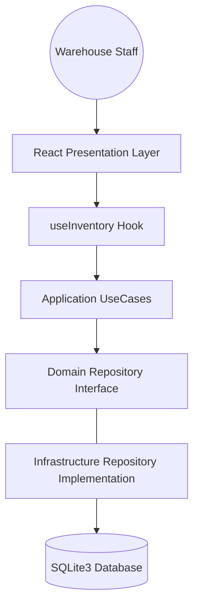
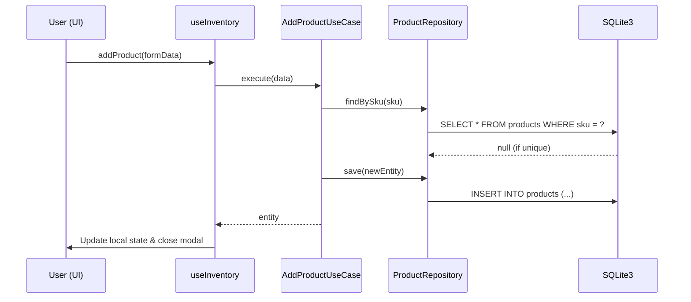

# Software Requirements Specification (SRS) - Smart Inventory

## 1. Overview
Mobile-first, desktop-optimized inventory management platform designed for SMEs. Provides high-fidelity UI/UX with professional analytics and clean data management.

## 2. Technical Stack
- **Frontend**: React 18, TypeScript, Tailwind CSS v4, Framer Motion
- **Runtime**: Vite, Node.js (Better-SQLite3 connectivity)
- **i18n**: i18next (JA/EN support)
- **Theming**: Class-based Adaptive Theme (Indigo-centric)
- **Database**: 
    - **Production**: SQLite3 (Local file persistence)
    - **Preview/Web**: InMemory Repository (for stateless verification)

## 3. Structural Design (C4 Model Level 3 & 4)

### C4 Level 3: Component Diagram

### C4 Level 4: Class Responsibility & Roles
| Layer              | Component             | Responsibility                                                    |
| :----------------- | :-------------------- | :---------------------------------------------------------------- |
| **Presentation**   | `Layout.tsx`          | Viewport management, Header/Nav state, Ambient gradients.         |
|                    | `Dashboard.tsx`       | Visualizing stock velocity, analytic chart rendering.             |
|                    | `ProductList.tsx`     | Search logic, grid-based card layout, stock status alerts.        |
|                    | `useInventory`        | State management using React Hooks (Redux-less architecture).     |
| **Application**    | `AddProductUseCase`   | Business rules: SKU validation, UUID generation, entity creation. |
|                    | `ListProductsUseCase` | Data retrieval logic, filtering, sorting.                         |
| **Domain**         | `Product Entity`      | Core business model/schema.                                       |
|                    | `IProductRepo`        | Behavioral contract (Interface) for data access.                  |
| **Infrastructure** | `SqliteProductRepo`   | implementation of IProductRepo using `better-sqlite3`.            |
|                    | `SqliteDatabase`      | DB Singleton instance & Schema migration manager.                 |

### Access Sequence Diagram (Product Addition)

## 4. UI/UX Specifications

### Color Palette (Indigo-Professional)
| Variant   | Primary   | Secondary | Background | Surface   |
| :-------- | :-------- | :-------- | :--------- | :-------- |
| **Light** | `#3730A3` | `#BE185D` | `#F1F5F9`  | `#FFFFFF` |
| **Dark**  | `#6366F1` | `#D946EF` | `#020617`  | `#0F172A` |

### Responsive Breakpoints
- **Mobile (< 640px)**: 1 column grid, compact header.
- **Tablet (640px - 1024px)**: 2 columns, adaptive charts.
- **Desktop (> 1024px)**: 4 columns for stats, 3 columns for lists, container padding scaled to `xl:px-40`.

## 5. Entities & Schema
- **Product**: `id(UUID)`, `sku(unique)`, `name`, `category`, `price`, `stock`, `unit`, `minStock`.
- **Movement**: `id`, `productId`, `type(IN/OUT)`, `quantity`, `reason`, `timestamp`.

## 6. Port Specification
- Default fixed port: `5555`.
