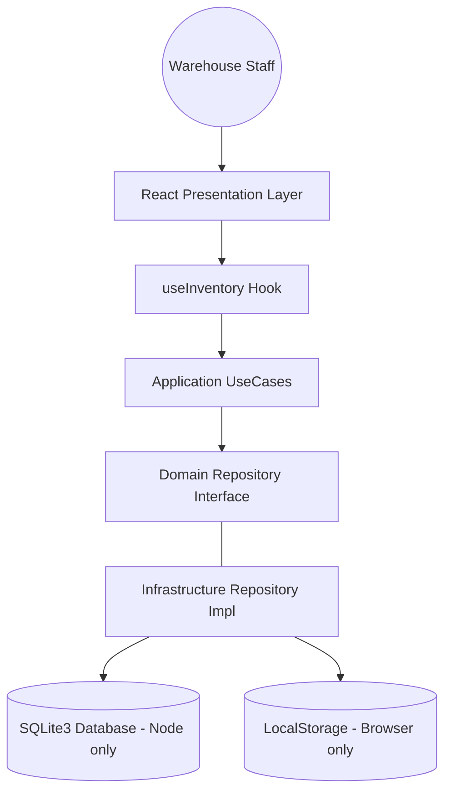
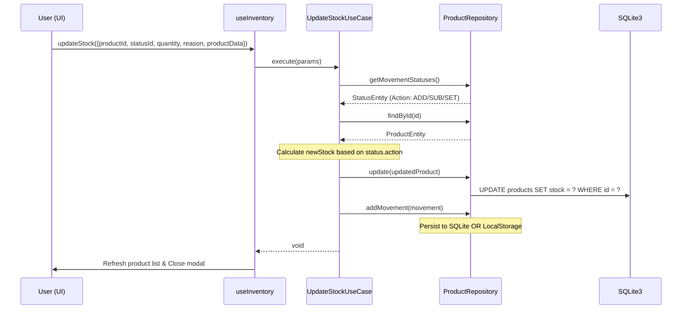
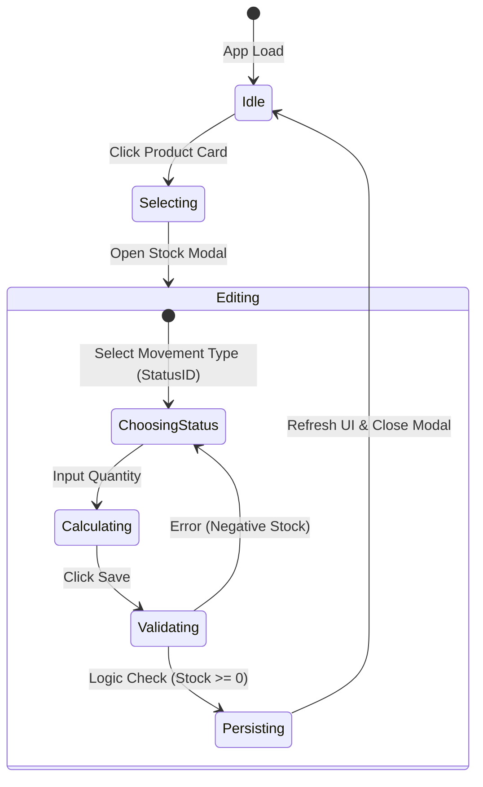

# Software Requirements Specification (SRS) - Smart Inventory

## 1. Overview
Mobile-first, desktop-optimized inventory management platform designed for SMEs. Provides high-fidelity UI/UX with professional analytics and clean data management.

## 2. Technical Stack
- **Frontend**: React 18, TypeScript, Tailwind CSS v4, Framer Motion
- **Runtime**: Vite, Node.js (Better-SQLite3 connectivity)
- **i18n**: i18next (JA/EN support)
- **Theming**: Class-based Adaptive Theme (Indigo-centric)
- **Database (Hybrid Strategy)**: 
    - **Desktop/Node**: SQLite3 (`better-sqlite3`) for local file persistence.
    - **Browser/PWA**: InMemory Repository with `localStorage` (ensures functionality without native Node.js binaries).

## 3. Structural Design (C4 Model Level 3 & 4)

### C4 Level 3: Component Diagram

```mermaid
graph TD
    User((Warehouse Staff))
    UI[React Presentation Layer]
    Hook[useInventory Hook]
    UC[Application UseCases]
    Repo[Domain Repository Interface]
    Impl[Infrastructure Repository Impl]
    DB_SQL[(SQLite3 Database - Node only)]
    DB_LS[(LocalStorage - Browser only)]

    User --> UI
    UI --> Hook
    Hook --> UC
    UC --> Repo
    Repo --- Impl
    Impl --> DB_SQL
    Impl --> DB_LS
```

### C4 Level 4: Class Responsibility & Roles
| Layer              | Component             | Responsibility                                                    |
| :----------------- | :-------------------- | :---------------------------------------------------------------- |
| **Presentation**   | `Layout.tsx`          | Viewport management, Header/Nav state, Ambient gradients.         |
| Presentation | `Dashboard.tsx` | Visualizing total value and stock velocity (moving average/sum for 14 days). |
|              | `ProductList.tsx` | SKU-centric list, search, CSV export, and filtered views (e.g., Low Stock). |
|                    | `useInventory`        | State management using React Hooks (Redux-less architecture).     |
| **Application**    | `ListProductsUseCase` | Data retrieval logic, filtering, sorting.                         |
|                    | `UpdateStockUseCase`  | Advanced stock calculation, movement tracking, and metadata updates. |
| **Domain**         | `Product Entity`      | Core business model/schema.                                       |
|                    | `MovementStatus`      | Movement type definitions (IN, OUT, RETURN, etc.).                |
|                    | `IProductRepo`        | Behavioral contract (Interface) for data access.                  |
| **Infrastructure** | `InMemoryProductRepo` | Implementation using `localStorage` for browser compatibility. |
|                    | `SqliteProductRepo`   | implementation of IProductRepo using `better-sqlite3`.            |
|                    | `SqliteDatabase`      | DB Singleton instance & Schema migration manager.                 |


### Access Sequence Diagram (Stock Movement/Inventory Update)

```mermaid
sequenceDiagram
    participant U as User (UI)
    participant H as useInventory
    participant UC as UpdateStockUseCase
    participant R as ProductRepository
    participant DB as SQLite3

    U->>H: updateStock({productId, statusId, quantity, reason, productData})
    H->>UC: execute(params)
    UC->>R: getMovementStatuses()
    R-->>UC: StatusEntity (Action: ADD/SUB/SET)
    UC->>R: findById(id)
    R-->>UC: ProductEntity
    Note over UC: Calculate newStock based on status.action
    UC->>R: update(updatedProduct)
    R->>DB: UPDATE products SET stock = ? WHERE id = ?
    UC->>R: addMovement(movement)
    Note over R: Persist to SQLite OR LocalStorage
    UC-->>H: void
    H->>U: Refresh product list & Close modal
```

## 4. UI/UX Specifications

### Color Palette (Indigo-Professional)
| Variant   | Primary   | Secondary | Background | Surface   |
| :-------- | :-------- | :-------- | :--------- | :-------- |
| **Light** | `#3730A3` | `#BE185D` | `#F1F5F9`  | `#FFFFFF` |
| **Dark**  | `#6366F1` | `#D946EF` | `#020617`  | `#0F172A` |

### Responsive Breakpoints
- **Mobile (< 640px)**: 1 column grid, compact header.
- **Tablet (640px - 1024px)**: 2 columns, adaptive charts.
- **Desktop (> 1024px)**: 4 columns for stats, 3 columns for lists, container padding scaled to `xl:px-40`.

## 5. Entities & Schema

### Domain Entities
- **Product**: `id(UUID)`, `sku(unique)`, `name`, `price`, `stock`, `unit`, `minStock`, `metadata(JSON)`, `imageUrl`, `createdAt`, `updatedAt`.
    - `metadata`: Stores `category`, `location`, `condition`, `notes`.
- **MovementStatus**: `id`, `name`, `action(ADD|SUBTRACT|SET)`, `color`.
- **StockMovement**: `id`, `productId`, `statusId`, `quantity`, `unitPrice`, `totalAmount`, `reason`, `timestamp`.

### SQLite Physical Table Definition
```sql
-- Products Table
CREATE TABLE products (
    id TEXT PRIMARY KEY,
    sku TEXT UNIQUE NOT NULL,
    name TEXT NOT NULL,
    price REAL DEFAULT 0,
    stock REAL DEFAULT 0,
    unit TEXT,
    minStock REAL DEFAULT 0,
    metadata TEXT, -- JSON string: {category, location, condition, notes}
    imageUrl TEXT,
    createdAt INTEGER NOT NULL,
    updatedAt INTEGER NOT NULL
);

-- Movement Statuses Table
CREATE TABLE movement_statuses (
    id TEXT PRIMARY KEY,
    name TEXT NOT NULL,
    action TEXT CHECK(action IN ('ADD', 'SUBTRACT', 'SET')) NOT NULL,
    color TEXT NOT NULL
);

-- Movements Table
CREATE TABLE movements (
    id TEXT PRIMARY KEY,
    productId TEXT NOT NULL,
    statusId TEXT NOT NULL,
    quantity REAL NOT NULL,
    unitPrice REAL DEFAULT 0,
    totalAmount REAL DEFAULT 0,
    reason TEXT,
    timestamp INTEGER NOT NULL,
    FOREIGN KEY (productId) REFERENCES products(id),
    FOREIGN KEY (statusId) REFERENCES movement_statuses(id)
);
```

## 6. UI Wireframes

### [WF-01] Inventory List (Home/Products)
```text
| Smart Inventory                       |
+---------------------------------------+
| [ Search SKU / Name... ] [Filter]     |
+---------------------------------------+
| Grid:                                 |
| +-----------+  +-----------+          |
| | iPhone 15 |  | MacBook   |          |
| | Qty: 45   |  | Qty: 12   |          |
| +-----------+  +-----------+          |
+---------------------------------------+
| [Home] [Inventory] [History] [Settings]|
+---------------------------------------+
```

### [WF-02] Stock Movement Entry (Modal)
```text
+---------------------------------------+
| Update Stock: Product Name       (X)  |
+---------------------------------------+
| [ Status ]                            |
| ( IN ) ( OUT ) ( RET ) ( CANCEL) (ADJ)|
+---------------------------------------+
| Metadata:                             |
| Name: [ iPhone 15 ] Cat: [ Smartph ]  |
| Loc: [ Wh A ] Cond: [ New ]           |
+---------------------------------------+
| Quantity: [ 10 ]  Unit: [ un ]        |
| Current: 45  -> Result: 55            |
+---------------------------------------+
| Reason: [ Optional text... ]          |
+---------------------------------------+
| [       SAVE MOVEMENT        ]        |
+---------------------------------------+
```

## 7. API I/O Specification (Use Case Level)

### UpdateStockUseCase.execute(input)
- **Input**:
    - `productId`: String (UUID)
    - `statusId`: String (ID of Status Entity)
    - `quantity`: Number
    - `reason`: String
    - `productData`: { name, category, unit, location, condition }
- **Output**: `Promise<void>`
- **Errors**: `Product not found`, `Invalid movement status`, `Stock cannot be negative`.


## 8. State Transition Sequence Diagram

### Inventory Change Lifecycle

```mermaid
stateDiagram-v2
    [*] --> Idle: App Load
    Idle --> Selecting: Click Product Card
    Selecting --> Editing: Open Stock Modal
    
    state Editing {
        [*] --> ChoosingStatus: Select Movement Type (StatusID)
        ChoosingStatus --> Calculating: Input Quantity
        Calculating --> Validating: Click Save
        Validating --> Persisting: Logic Check (Stock >= 0)
        Validating --> ChoosingStatus: Error (Negative Stock)
    }
    
    Persisting --> Idle: Refresh UI & Close Modal
```

## 10. Cloud REST API Transfer Specification (zaico Synchronization)

### 10.1 Synchronization Policy
Cloud synchronization is designed with an asynchronous reconciliation pattern to ensure system responsiveness and offline capability.

- **Queue Stack Architecture**: Local operations are immediately persisted to the local SQLite database. If Cloud Sync is enabled, the operation is pushed to a `SyncQueue` (Local Storage or SQLite table).
- **Synchronization Trigger**: The system attempts to flush the queue sequentially when the application is **Online**.
- **On/Off Toggle**: Users can enable/disable Cloud Synchronization via the **Settings Screen**. When disabled, no items are added to the queue.

### 10.2 Master Synchronization Flow (SKU-Centric)
Before any stock movement is recorded in the cloud, the product must be identified or created using the SKU (`code`).

1.  **Product Lookup**: `GET /api/v1/inventories?code={sku}`
    - If found: Store the Cloud ID (`id`).
    - If not found: Proceed to **Product Creation**.
2.  **Product Creation (POST)** or **Update (PUT)**:
    - **Endpoint**: `/api/v1/inventories` (POST) or `/api/v1/inventories/{id}` (PUT)
    - **Logic**: Ensure master attributes (category, location, etc.) match the local state.

### 10.3 Metadata & Optional Attributes Specification
Local `metadata` is mapped to zaico's fixed fields and the `optional_attributes` (Key-Value array).

#### Master Data Mapping (JSON Structure)
The following JSON structure must be strictly followed when sending data to zaico:

```json
{
  "title": "Product Name",
  "code": "SKU-001",
  "unit": "pcs",
  "category": "Electronic",
  "place": "Warehouse A",
  "state": "New",
  "etc": "Special handling required",
  "optional_attributes": [
    {
      "name": "Weight",
      "value": "1.5kg"
    },
    {
      "name": "Material",
      "value": "Aluminum"
    }
  ]
}
```

- **Fixed Fields**: `title` (name), `code` (sku), `category`, `place` (location), `state` (condition), `etc` (notes).
- **Optional Attributes**: All other keys in local `metadata` exceeding the fixed fields must be converted into the `[{"name": "Key", "value": "Value"}]` format.

### 10.4 Operation Mapping Table

| Operation | Cloud API Method | Endpoint | Logic / Status |
| :--- | :--- | :--- | :--- |
| **Add Product** | `POST` | `/api/v1/inventories` | Creates base record. |
| **Stock In** | `POST` | `/api/v1/purchases/` | `status: "purchased"`. |
| **Stock Out** | `POST` | `/api/v1/packing_slips/` | `status: "completed_delivery"`. |
| **Return** | `POST` | `/api/v1/purchases/` | Negative quantity, `status: "purchased"`. |
| **Cancel** | `POST` | `/api/v1/packing_slips/` | Negative quantity, `status: "completed_delivery"`. |
| **Stocktake** | `PUT` | `/api/v1/inventories/{id}` | Update `quantity` & `stocktake_attributes`. |

### 10.5 Queue Data Schema
Queue items must store the necessary context to retry failed operations:
- `operationType`: (CREATE_PRODUCT | UPDATE_STOCK | STOCK_TAKEOVER)
- `payload`: The full JSON body for the API.
- `retryCount`: Initialized to 0.
- `status`: (PENDING | PROCESSING | FAILED).
- `timestamp`: Creation time for sequential processing.

### 10.6 Synchronization Monitoring & Management
To support real-time feedback in the UI, the Synchronization Repository provides:
- **Pending Count**: Returns the total number of items currently in `PENDING` or `FAILED` (with retries left) status.
- **Cleanup**: Allows manual or automatic removal of `COMPLETED` records to maintain database performance.
- **Manual Trigger**: Users can manually trigger the synchronization process via the settings interface, overriding the background interval.
