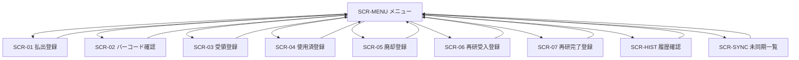
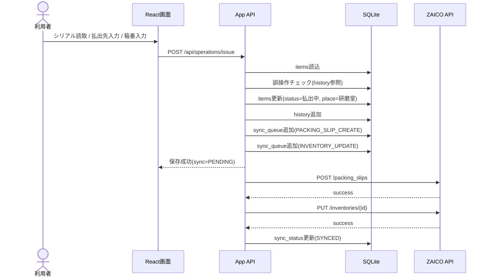
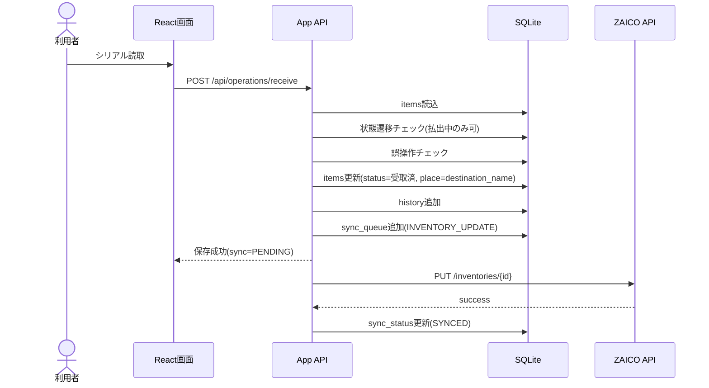
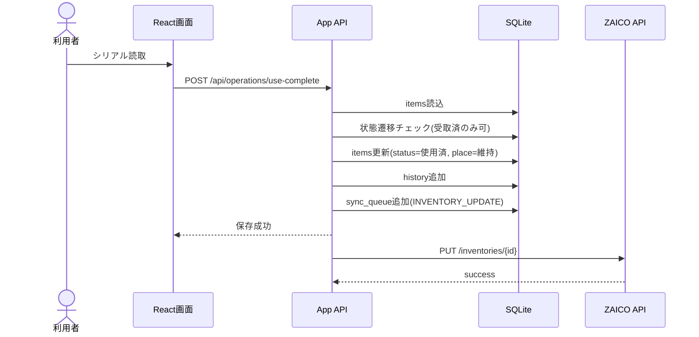
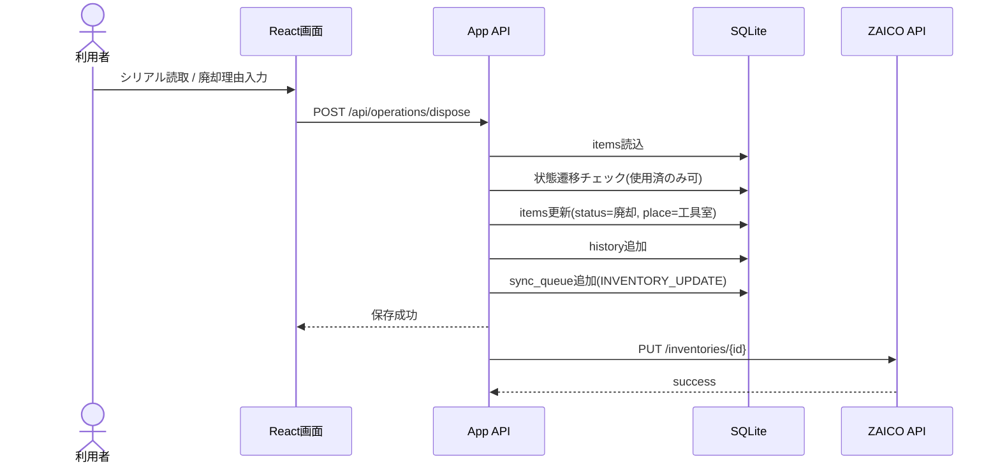
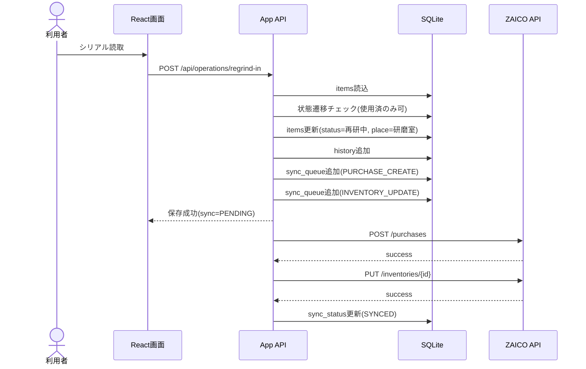
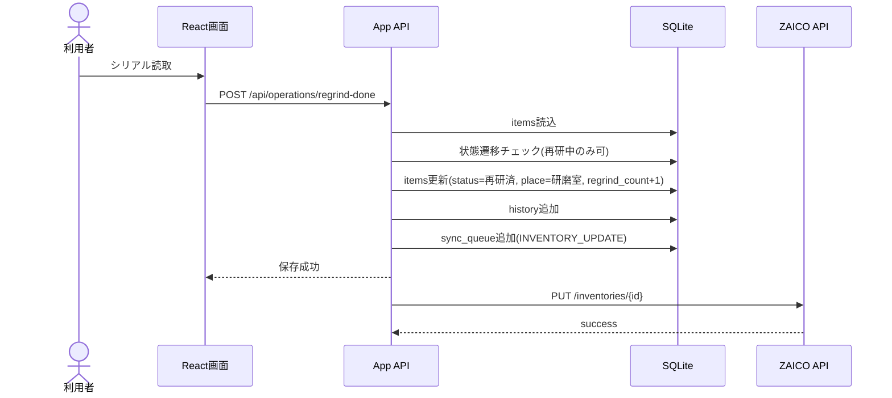

承知した。以下に、回答内容を反映し、**表記ゆれ・認識齟齬を抑止するための用語定義、画面項目名定義、状態遷移表、移送表、ZAICO同期方針**を明確化した**改訂版SRS**を提示する。

なお、本改訂版では以下を正式前提として採用する。

* 旧システム：ReTool（ノーコード）
* 新システム：React によるスクラッチ開発
* ローカル最新状態：SQLite に保持
* ZAICO連携：ユーザー任意保存時、または業務遷移時に同期
* 個体管理方式：**推奨案A（1個体 = 1シリアルNo. = 1ZAICO在庫レコード）**
* ZAICO項目マッピング：**state = 業務ステータス、place = 所在**
* 「払出」＝業務用語、「出庫」＝ZAICO API/システム機能用語
* 出庫先である「各現場」は、ZAICO取引先データ上の表示名であり、同時に所在として `place` にも格納する
* ZAICO API は Bearer Token 認証を採用し、在庫検索では `code` の完全一致検索が可能であり、在庫データには `state`、`place`、`code`、`optional_attributes` が存在する。加えて、出庫データ `POST /api/v1/packing_slips/` では `status=completed_delivery` 指定時に在庫数量が減少し、入庫データ `POST /api/v1/purchases/` では `status=purchased` 指定時に在庫数量が増加する。取引先データ一覧 API は `GET /api/v1/customers/` で提供される。 ([zaicodev.github.io][1])

---

# ZAICO連携 個体管理アプリ SRS

**Version 1.1（改訂版）**

## 1. 文書情報

* 文書名：ZAICO連携 個体管理アプリ SRS
* 版数：1.1
* 作成日：2026-03-11
* 対象システム

  * 旧システム：ReTool ベース個体管理補助機能
  * 新システム：React + SQLite + ZAICO REST API 連携アプリ
* 文書目的：工具・副資材の個体管理業務を、スクラッチ開発した新システムへ移行するための要求仕様を定義する

---

## 2. 背景と目的

旧システムは ReTool を利用したノーコード構成であり、画面構成や業務フローの柔軟性、ローカル保持、同期制御、監査性の観点で制約があった。新システムでは、React によるスクラッチ開発と SQLite によるローカル状態保持を採用し、個体単位の状態遷移をより厳密に扱う。

本システムの目的は、工具・副資材を**シリアルNo.単位で追跡**し、業務用語としての「払出」と、ZAICO API上の機能用語としての「出庫」を明確に切り分けたうえで、内部状態とZAICO在庫状態の整合性を保つことである。

---

## 3. 基本方針

### 3.1 開発方針

* フロントエンド：React
* ローカルデータストア：SQLite
* 外部連携先：ZAICO REST API
* 旧 ReTool 画面は参照元業務仕様と位置付け、新システムでは再設計する

### 3.2 個体管理方針

* 1個体 = 1シリアルNo. = 1ZAICO在庫レコード
* ZAICO在庫 `code` にシリアルNo.を格納する
* ZAICO在庫数量は原則 1 とする
* ローカル SQLite には、最新状態・操作履歴・同期履歴・補助属性を保持する

ZAICOの在庫一覧取得では `code` による完全一致検索が可能であり、在庫データには `state`、`place`、`code` 等の属性があるため、本方式と整合する。 ([zaicodev.github.io][1])

### 3.3 状態保持方針

* 最新状態の正本はローカル SQLite に保持する
* ZAICO は外部連携先であり、ローカル状態から同期する
* 同期トリガーは以下の2種類とする

  1. ユーザーの任意保存操作
  2. 業務フロー上の状態遷移確定時

### 3.4 ZAICOマッピング方針

* 業務ステータス → ZAICO `state`
* 所在 → ZAICO `place`
* シリアルNo. → ZAICO `code`
* 補助属性（箱番、再研磨回数、直近払出先等）→ ローカルSQLiteを主、必要時のみ `optional_attributes` へ反映
* 出庫先である「各現場」は、ZAICO取引先表示名と一致させ、同じ値を `place` にも格納する

---

## 4. 用語定義

表記ゆれを防ぐため、本SRSでは以下の用語を正式用語とする。

| 用語      | 定義                          | 使用場面                      |
| ------- | --------------------------- | ------------------------- |
| 払出      | 現場へ物品を渡す業務行為                | 業務説明、画面表示                 |
| 出庫      | ZAICOの出庫データ作成機能、およびシステム連携処理 | API、内部処理                  |
| 返却      | 現場から戻す業務行為全般                | 業務説明                      |
| 入庫      | ZAICOの入庫データ作成機能、およびシステム連携処理 | API、内部処理                  |
| 業務ステータス | 個体の業務上の状態                   | 画面表示、ローカルDB、ZAICO `state` |
| 所在      | 個体の現在位置または現在所属先             | 画面表示、ローカルDB、ZAICO `place` |
| 出庫先     | 払出対象の現場・取引先                 | 画面表示、取引先マスタ               |
| シリアルNo. | 個体を一意に識別するバーコード値            | 業務キー、ZAICO `code`         |
| 箱番      | 払出時の配送単位識別番号                | ローカル補助属性                  |
| 同期      | ローカル状態をZAICOへ反映する処理         | 内部処理                      |

---

## 5. スコープ

### 5.1 対象業務

1. 払出登録
2. バーコード確認
3. 受領登録
4. 使用済登録
5. 廃却登録
6. 再研受入登録
7. 再研完了登録

### 5.2 対象機能

* 画面入力
* バーコード読取
* 状態遷移制御
* SQLite最新状態管理
* ZAICO同期
* 同期失敗時の再送
* 操作ログ管理

---

## 6. 画面項目名標準定義

画面設計、DB設計、APIマッピングで名称を統一するため、以下を正式項目名とする。

| 画面表示名   | 内部項目名              | 型        | 説明                        |
| ------- | ------------------ | -------- | ------------------------- |
| シリアルNo. | serial_no          | TEXT     | 個体識別子。ZAICO `code` と一致    |
| 物品名     | item_name          | TEXT     | 物品名称。ZAICO `title` と対応    |
| 業務ステータス | business_status    | TEXT     | ZAICO `state` に格納         |
| 所在      | place_name         | TEXT     | ZAICO `place` に格納         |
| 出庫先     | destination_name   | TEXT     | ZAICO取引先表示名と一致させる         |
| 箱番      | box_no             | TEXT     | 半角数字9桁固定                  |
| 再研磨回数   | regrind_count      | INTEGER  | 再研完了時に加算                  |
| 同期状態    | sync_status        | TEXT     | PENDING / SYNCED / FAILED |
| 最終同期日時  | last_synced_at     | DATETIME | 最終同期時刻                    |
| 操作者     | operated_by        | TEXT     | 操作ユーザー                    |
| 操作日時    | operated_at        | DATETIME | 操作時刻                      |
| 備考      | remarks            | TEXT     | 任意入力                      |
| 直近エラー内容 | sync_error_message | TEXT     | 同期失敗理由                    |

---

## 7. 業務ステータス・所在の正式値定義

### 7.1 業務ステータス正式値

| 表示名 | コード        | ZAICO state 格納値 |
| --- | ---------- | --------------- |
| 在庫  | STOCK      | 在庫              |
| 払出中 | ISSUING    | 払出中             |
| 受取済 | RECEIVED   | 受取済             |
| 使用済 | USED       | 使用済             |
| 廃却  | DISPOSED   | 廃却              |
| 再研中 | REGRINDING | 再研中             |
| 再研済 | REGRINDED  | 再研済             |

### 7.2 所在正式値

| 表示名 | コード           | ZAICO place 格納値 |
| --- | ------------- | --------------- |
| 工具室 | TOOL_ROOM     | 工具室             |
| 研磨室 | GRINDING_ROOM | 研磨室             |
| 各現場 | SITE          | 取引先表示名をそのまま格納   |

補足として、「各現場」は固定文言ではなく、実際にはZAICO取引先データの表示名を採用する。ZAICOには取引先データ一覧 API が存在するため、現場候補の取得元として利用可能である。 ([zaicodev.github.io][1])

---

## 8. 状態遷移表

### 8.1 正式状態遷移表

| 操作   | 操作名称    | 遷移前      | 遷移後  | 所在遷移            | 備考     |
| ---- | ------- | -------- | ---- | --------------- | ------ |
| OP01 | 払出登録    | 在庫 / 再研済 | 払出中  | 工具室または研磨室 → 研磨室 | 払出準備確定 |
| OP02 | バーコード確認 | 任意       | 変更なし | 変更なし            | 参照のみ   |
| OP03 | 受領登録    | 払出中      | 受取済  | 研磨室 → 出庫先現場     | 現場受領確定 |
| OP04 | 使用済登録   | 受取済      | 使用済  | 出庫先現場 → 出庫先現場   | 現場使用完了 |
| OP05 | 廃却登録    | 使用済      | 廃却   | 出庫先現場 → 工具室     | 廃却確定   |
| OP06 | 再研受入登録  | 使用済      | 再研中  | 出庫先現場 → 研磨室     | 再研磨受付  |
| OP07 | 再研完了登録  | 再研中      | 再研済  | 研磨室 → 研磨室       | 再研磨完了  |

### 8.2 遷移制約

* 許可されていない遷移はすべてエラーとする
* 状態と所在は、画面入力ではなく**システム自動設定**を原則とする
* ユーザーが入力するのは、主にシリアルNo.、出庫先、箱番、備考に限定する

---

## 9. 移送表（業務操作とZAICO同期の対応表）

本章では、認識齟齬を避けるため、**業務上の移送・状態変更**と**ZAICO同期内容**を対応付ける。

| OP   | 業務操作名   | 業務用語    | システム機能用語 | ZAICO API                            | state 更新 | place 更新 | 数量変動 |
| ---- | ------- | ------- | -------- | ------------------------------------ | -------- | -------- | ---- |
| OP01 | 払出登録    | 払出      | 出庫       | `POST /api/v1/packing_slips/` + 在庫更新 | 払出中      | 研磨室      | 減少あり |
| OP02 | バーコード確認 | 確認      | 参照       | なし                                   | なし       | なし       | なし   |
| OP03 | 受領登録    | 受領      | 在庫更新     | `PUT /api/v1/inventories/{id}`       | 受取済      | 出庫先現場    | なし   |
| OP04 | 使用済登録   | 使用済     | 在庫更新     | `PUT /api/v1/inventories/{id}`       | 使用済      | 出庫先現場    | なし   |
| OP05 | 廃却登録    | 返却・廃却   | 在庫更新     | `PUT /api/v1/inventories/{id}`       | 廃却       | 工具室      | なし   |
| OP06 | 再研受入登録  | 返却・再研受入 | 入庫       | `POST /api/v1/purchases/` + 在庫更新     | 再研中      | 研磨室      | 増加あり |
| OP07 | 再研完了登録  | 再研完了    | 在庫更新     | `PUT /api/v1/inventories/{id}`       | 再研済      | 研磨室      | なし   |

ZAICO出庫データ作成では `status=completed_delivery` 指定時に対象在庫の数量が減少し、入庫データ作成では `status=purchased` 指定時に数量が増加する。したがって、数量変動イベントは OP01 と OP06 のみとする。 ([zaicodev.github.io][1])

---

## 10. 画面要件

## 10.1 共通画面方針

* 画面上に「業務ステータス」「所在」は表示するが、原則編集不可とする
* 入力対象は必要最小限とする
* バーコード読取を主操作とする
* 登録後、ローカル保存を先行し、同期可否を明示する

---

## 10.2 画面一覧

| 画面ID     | 画面名       | 主目的         |
| -------- | --------- | ----------- |
| SCR-OP01 | 払出登録画面    | 在庫個体を払出中へ遷移 |
| SCR-OP02 | バーコード確認画面 | 個体最新状態の参照   |
| SCR-OP03 | 受領登録画面    | 現場受領の確定     |
| SCR-OP04 | 使用済登録画面   | 使用済化        |
| SCR-OP05 | 廃却登録画面    | 廃却確定        |
| SCR-OP06 | 再研受入登録画面  | 再研中へ遷移      |
| SCR-OP07 | 再研完了登録画面  | 再研済へ遷移      |

---

## 10.3 SCR-OP01 払出登録画面

### 入力項目

| 項目名     | 必須 | 編集可否 | 備考              |
| ------- | -- | ---- | --------------- |
| シリアルNo. | 必須 | 可    | バーコード読取         |
| 出庫先     | 必須 | 可    | ZAICO取引先表示名から選択 |
| 箱番      | 必須 | 可    | 半角数字9桁          |
| 備考      | 任意 | 可    | ローカル保持          |

### 表示項目

| 項目名     | 備考                        |
| ------- | ------------------------- |
| 物品名     | 参照表示                      |
| 業務ステータス | 自動表示：払出中                  |
| 所在      | 自動表示：研磨室                  |
| 同期状態    | PENDING / SYNCED / FAILED |

### 処理

1. シリアルNo.でローカル検索
2. 状態が「在庫」または「再研済」であることを確認
3. ローカル更新
4. 出庫データ作成
5. 在庫更新
6. 履歴記録

---

## 10.4 SCR-OP02 バーコード確認画面

### 入力項目

| 項目名     | 必須 | 編集可否 |
| ------- | -- | ---- |
| シリアルNo. | 必須 | 可    |

### 表示項目

| 項目名     | 備考  |
| ------- | --- |
| 物品名     |     |
| 業務ステータス |     |
| 所在      |     |
| 出庫先     | 直近値 |
| 箱番      | 直近値 |
| 再研磨回数   |     |
| 同期状態    |     |
| 最終同期日時  |     |

### 処理

* ローカル SQLite の最新状態を表示
* 必要に応じて再同期ボタンからZAICO同期可能

---

## 10.5 SCR-OP03 受領登録画面

### 入力項目

| 項目名     | 必須 | 編集可否 |
| ------- | -- | ---- |
| シリアルNo. | 必須 | 可    |

### 自動設定

* 業務ステータス：受取済
* 所在：出庫先現場名

### 処理

* 在庫更新 API 同期

---

## 10.6 SCR-OP04 使用済登録画面

### 入力項目

| 項目名     | 必須 | 編集可否 |
| ------- | -- | ---- |
| シリアルNo. | 必須 | 可    |

### 自動設定

* 業務ステータス：使用済
* 所在：出庫先現場名

### 処理

* 在庫更新 API 同期

---

## 10.7 SCR-OP05 廃却登録画面

### 入力項目

| 項目名     | 必須 | 編集可否 |
| ------- | -- | ---- |
| シリアルNo. | 必須 | 可    |
| 備考      | 任意 | 可    |

### 自動設定

* 業務ステータス：廃却
* 所在：工具室

### 処理

* 在庫更新 API 同期

---

## 10.8 SCR-OP06 再研受入登録画面

### 入力項目

| 項目名     | 必須 | 編集可否 |
| ------- | -- | ---- |
| シリアルNo. | 必須 | 可    |

### 自動設定

* 業務ステータス：再研中
* 所在：研磨室

### 処理

1. ローカル更新
2. 入庫データ作成
3. 在庫更新
4. 履歴記録

---

## 10.9 SCR-OP07 再研完了登録画面

### 入力項目

| 項目名     | 必須 | 編集可否 |
| ------- | -- | ---- |
| シリアルNo. | 必須 | 可    |

### 自動設定

* 業務ステータス：再研済
* 所在：研磨室
* 再研磨回数：+1

### 処理

* 在庫更新 API 同期

---

## 11. ローカルデータ要件

## 11.1 Item

| 項目                 | 型           | 説明        |
| ------------------ | ----------- | --------- |
| item_id            | INTEGER PK  | ローカル内部ID  |
| serial_no          | TEXT UNIQUE | シリアルNo.   |
| zaico_inventory_id | INTEGER     | ZAICO在庫ID |
| item_name          | TEXT        | 物品名       |
| business_status    | TEXT        | 業務ステータス   |
| place_name         | TEXT        | 所在        |
| destination_name   | TEXT        | 出庫先       |
| box_no             | TEXT        | 箱番        |
| regrind_count      | INTEGER     | 再研磨回数     |
| sync_status        | TEXT        | 同期状態      |
| last_synced_at     | DATETIME    | 最終同期日時    |
| remarks            | TEXT        | 備考        |
| created_at         | DATETIME    | 作成日時      |
| updated_at         | DATETIME    | 更新日時      |

## 11.2 ItemOperationHistory

| 項目                   | 型          | 説明        |
| -------------------- | ---------- | --------- |
| history_id           | INTEGER PK | 履歴ID      |
| item_id              | INTEGER    | 個体ID      |
| serial_no            | TEXT       | シリアルNo.   |
| operation_code       | TEXT       | OP01〜OP07 |
| operation_name       | TEXT       | 操作名称      |
| prev_business_status | TEXT       | 変更前状態     |
| new_business_status  | TEXT       | 変更後状態     |
| prev_place_name      | TEXT       | 変更前所在     |
| new_place_name       | TEXT       | 変更後所在     |
| destination_name     | TEXT       | 出庫先       |
| box_no               | TEXT       | 箱番        |
| operated_by          | TEXT       | 操作者       |
| operated_at          | DATETIME   | 操作日時      |
| sync_status          | TEXT       | 同期状態      |
| sync_error_message   | TEXT       | 同期エラー内容   |

## 11.3 SyncQueue

| 項目               | 型          | 説明                                  |
| ---------------- | ---------- | ----------------------------------- |
| queue_id         | INTEGER PK | キューID                               |
| history_id       | INTEGER    | 履歴ID                                |
| api_type         | TEXT       | INVENTORY / PACKING_SLIP / PURCHASE |
| request_payload  | TEXT       | リクエストJSON                           |
| response_payload | TEXT       | レスポンスJSON                           |
| retry_count      | INTEGER    | 再試行回数                               |
| status           | TEXT       | PENDING / SUCCESS / FAILED          |
| created_at       | DATETIME   | 作成日時                                |
| updated_at       | DATETIME   | 更新日時                                |

---

## 12. ZAICO API要件

### 12.1 認証

* Bearer Token 認証を使用する ([zaicodev.github.io][1])

### 12.2 在庫検索

* `GET /api/v1/inventories?code={serial_no}`
* `code` は完全一致検索とする ([zaicodev.github.io][1])

### 12.3 在庫更新

* `PUT /api/v1/inventories/{id}`
* 更新対象

  * `state`
  * `place`
  * `optional_attributes`
  * 必要に応じて `etc` ([zaicodev.github.io][1])

### 12.4 出庫データ作成

* `POST /api/v1/packing_slips/`
* 想定利用値

  * `status = completed_delivery`
  * `delivery_date`
  * `customer_name = 出庫先表示名`
  * `deliveries[].inventory_id`
  * `deliveries[].quantity = 1`

`completed_delivery` 指定時は在庫数量が減少する。 ([zaicodev.github.io][1])

### 12.5 入庫データ作成

* `POST /api/v1/purchases/`
* 想定利用値

  * `status = purchased`
  * `purchase_date`
  * `customer_name = 出庫先表示名または回収元`
  * `purchase_items[].inventory_id`
  * `purchase_items[].quantity = 1`

`purchased` 指定時は在庫数量が増加する。ドキュメント本文には `purcahse_date` という綴りがあるが、項目名説明全体との整合上、実装設計では `purchase_date` を正式採用し、接続試験で最終確認するものとする。 ([zaicodev.github.io][1])

### 12.6 取引先取得

* `GET /api/v1/customers/`
* 出庫先候補一覧に利用する ([zaicodev.github.io][1])

---

## 13. 同期要件

### 13.1 同期トリガー

* 任意保存
* 業務遷移確定

### 13.2 同期順序

1. ローカル保存
2. SyncQueue 登録
3. ZAICO API 呼出
4. 成功時は `SYNCED`
5. 失敗時は `FAILED`

### 13.3 同期失敗時

* ローカル登録は保持する
* 再送ボタンから再同期可能とする
* 二重送信防止のため、履歴単位で一意な同期要求IDを内部採番する

---

## 14. 入力・バリデーション要件

### 14.1 シリアルNo.

* 必須
* バーコード読取を原則とする

### 14.2 箱番

* 必須画面：払出登録画面
* 半角数字9桁
* 正規表現：`^[0-9]{9}$`

### 14.3 重複操作防止

* 同一シリアルNo.かつ同一操作コードについて、最後の成功登録から30分以内の場合は警告表示

---

## 15. 非機能要件

### 15.1 性能

* バーコード読取から画面反映まで1秒以内を目標とする
* ローカル保存はAPI応答待ちに依存しない

### 15.2 可用性

* ZAICO障害時もローカル記録は継続可能とする
* 障害復旧後に再送可能とする

### 15.3 監査性

* すべての状態遷移を履歴として保持する
* 変更前後の状態、所在、操作者、同期結果を保持する

### 15.4 操作性

* 初期フォーカスをシリアルNo.入力欄に設定
* Enterキーによる登録を可能とする
* 読取成功／失敗を明示表示する

---

## 16. 未確定事項

1. ZAICO `optional_attributes` に箱番・再研磨回数を同期するか否か
2. 取引先データと現場マスタの完全同一化可否
3. 入庫時 `customer_name` の正式運用値
4. 廃却後のZAICO在庫扱いの運用詳細
5. 任意保存時に同期対象とする項目範囲

---

## 17. 結論

今回の改訂により、以下の曖昧さは解消された。

* 旧システムと新システムの位置付け
* 「払出」と「出庫」の用語差
* 個体管理方式
* `state` と `place` の役割
* ローカルSQLite最新状態保持とZAICO同期の関係
* 画面項目名の正式名称
* 状態遷移表と移送表の区別
* 出庫先と所在の統一ルール

以下に、**画面ワイヤーフレーム、API I/O仕様書、SQLite物理テーブル定義、状態遷移シーケンス図**を、これまで確定した前提に基づいて一体で整理する。
本仕様では、**ローカル SQLite が最新状態の正本**であり、**ZAICO は同期先**である。また、ZAICO 側では在庫データに `state`、`place`、`code`、`optional_attributes` があり、在庫検索は `code` 指定で実施できる。出庫は `POST /api/v1/packing_slips/`、入庫は `POST /api/v1/purchases/`、在庫更新は `PUT /api/v1/inventories/{id}`、取引先取得は `GET /api/v1/customers/` を利用する。 ([ZaicoDev][1])

---

# 1. 前提整理

## 1.1 基本方針

* 旧システム：ReTool
* 新システム：React + SQLite + ZAICO API
* 1個体 = 1シリアルNo. = 1ZAICO在庫レコード
* `state` に業務ステータスを保存
* `place` に所在を保存
* `code` にシリアルNo.を保存
* 箱番、再研磨回数、補助情報はローカル保持を主とし、必要に応じて `optional_attributes` へ反映する ([ZaicoDev][1])

## 1.2 業務ステータスと所在の正式値

### 業務ステータス

* 在庫
* 払出中
* 受取済
* 使用済
* 廃却
* 再研中
* 再研済

### 所在

* 工具室
* 研磨室
* 各現場（実体は ZAICO 取引先表示名）

### 変更原則

* ステータスと所在は**画面入力ではなく、自動設定**とする
* ユーザー入力は主として

  * シリアルNo.
  * 払出先
  * 箱番
  * 備考
    に限定する

---

# 2. 画面遷移定義

## 2.1 画面一覧

| 画面ID     | 画面名       | 用途   |
| -------- | --------- | ---- |
| SCR-MENU | メニュー画面    | 操作選択 |
| SCR-01   | 払出登録画面    | 操作①  |
| SCR-02   | バーコード確認画面 | 操作②  |
| SCR-03   | 受領登録画面    | 操作③  |
| SCR-04   | 使用済登録画面   | 操作④  |
| SCR-05   | 廃却登録画面    | 操作⑤  |
| SCR-06   | 再研受入登録画面  | 操作⑥  |
| SCR-07   | 再研完了登録画面  | 操作⑦  |
| SCR-HIST | 履歴確認画面    | 任意拡張 |
| SCR-SYNC | 未同期一覧画面   | 任意拡張 |

## 2.2 画面遷移図



## 2.3 画面遷移時の業務制約

* SCR-03 は、対象個体の現在ステータスが `払出中` のときのみ登録可能
* SCR-04 は、対象個体の現在ステータスが `受取済` のときのみ登録可能
* SCR-05 / SCR-06 は、対象個体の現在ステータスが `使用済` のときのみ登録可能
* SCR-07 は、対象個体の現在ステータスが `再研中` のときのみ登録可能
* SCR-01 は、対象個体の現在ステータスが `在庫` または `再研済` のときのみ登録可能

---

# 3. 画面ワイヤーフレーム

以下では、**入力項目・表示項目・登録時に変更されるステータスと所在**を明示する。

---

## 3.1 SCR-MENU メニュー画面

```text
+--------------------------------------------------+
| 個体管理メニュー                                  |
+--------------------------------------------------+
| [1] 払出登録                                     |
| [2] バーコード確認                               |
| [3] 受領登録                                     |
| [4] 使用済登録                                   |
| [5] 廃却登録                                     |
| [6] 再研受入登録                                 |
| [7] 再研完了登録                                 |
|--------------------------------------------------|
| [履歴確認] [未同期一覧]                           |
+--------------------------------------------------+
```

---

## 3.2 SCR-01 払出登録画面

### 画面目的

在庫または再研済の個体を、払出中へ遷移させる。

### ワイヤーフレーム

```text
+--------------------------------------------------------------+
| 払出登録                                                     |
+--------------------------------------------------------------+
| シリアルNo.        [ バーコード読取 ______________________ ] |
| 読取済シリアルNo.  [ A123456789___________________________ ] |
| 物品名             [ エンドミル 10mm _____________________ ] |
| 現在ステータス     [ 在庫 ________________________________ ] |
| 現在地             [ 工具室 ______________________________ ] |
|--------------------------------------------------------------|
| 払出先             [ ▼ 現場A _____________________________ ] |
| 箱番               [ 001002003 ____________________________ ] |
| 備考               [ _____________________________________ ] |
|--------------------------------------------------------------|
| 変更後ステータス   [ 払出中 ]   ※自動設定                  |
| 変更後現在地       [ 研磨室 ]   ※自動設定                  |
| 同期状態           [ PENDING / SYNCED / FAILED ]            |
| メッセージ         [                                    ]   |
|--------------------------------------------------------------|
| [登録] [クリア] [戻る]                                      |
+--------------------------------------------------------------+
```

### 登録時の変更内容

* ステータス：`在庫` または `再研済` → `払出中`
* 現在地：`工具室` または `研磨室` → `研磨室`
* 払出先：入力値を保存
* 箱番：入力値を保存

### 活性条件

* シリアルNo. 読取済
* 払出先 選択済
* 箱番 9桁妥当
* 現在ステータスが `在庫` または `再研済`

---

## 3.3 SCR-02 バーコード確認画面

```text
+--------------------------------------------------------------+
| バーコード確認                                               |
+--------------------------------------------------------------+
| シリアルNo.        [ バーコード読取 ______________________ ] |
| 読取済シリアルNo.  [ A123456789___________________________ ] |
|--------------------------------------------------------------|
| 物品名             [ エンドミル 10mm _____________________ ] |
| 現在ステータス     [ 払出中 ______________________________ ] |
| 現在地             [ 研磨室 ______________________________ ] |
| 払出先             [ 現場A ________________________________ ] |
| 箱番               [ 001002003 ____________________________ ] |
| 再研磨回数         [ 2 ___________________________________ ] |
| 同期状態           [ SYNCED ______________________________ ] |
| 最終同期日時       [ 2026/03/12 10:23:45 _________________ ] |
|--------------------------------------------------------------|
| [戻る] [再読取]                                             |
+--------------------------------------------------------------+
```

### 更新有無

* なし
* 表示専用

---

## 3.4 SCR-03 受領登録画面

```text
+--------------------------------------------------------------+
| 受領登録                                                     |
+--------------------------------------------------------------+
| シリアルNo.        [ バーコード読取 ______________________ ] |
| 読取済シリアルNo.  [ A123456789___________________________ ] |
| 物品名             [ エンドミル 10mm _____________________ ] |
| 現在ステータス     [ 払出中 ______________________________ ] |
| 現在地             [ 研磨室 ______________________________ ] |
| 払出先             [ 現場A ________________________________ ] |
|--------------------------------------------------------------|
| 変更後ステータス   [ 受取済 ]   ※自動設定                  |
| 変更後現在地       [ 現場A ]     ※払出先を自動採用         |
| 備考               [ _____________________________________ ] |
| メッセージ         [                                    ]   |
|--------------------------------------------------------------|
| [登録] [クリア] [戻る]                                      |
+--------------------------------------------------------------+
```

### 登録時の変更内容

* ステータス：`払出中` → `受取済`
* 現在地：`研磨室` → `払出先`
* 払出先：変更しない（既存値維持）

---

## 3.5 SCR-04 使用済登録画面

```text
+--------------------------------------------------------------+
| 使用済登録                                                   |
+--------------------------------------------------------------+
| シリアルNo.        [ バーコード読取 ______________________ ] |
| 読取済シリアルNo.  [ A123456789___________________________ ] |
| 物品名             [ エンドミル 10mm _____________________ ] |
| 現在ステータス     [ 受取済 ______________________________ ] |
| 現在地             [ 現場A ________________________________ ] |
|--------------------------------------------------------------|
| 変更後ステータス   [ 使用済 ]   ※自動設定                  |
| 変更後現在地       [ 現場A ]     ※据置                     |
| 備考               [ _____________________________________ ] |
|--------------------------------------------------------------|
| [登録] [クリア] [戻る]                                      |
+--------------------------------------------------------------+
```

### 登録時の変更内容

* ステータス：`受取済` → `使用済`
* 現在地：変更なし

---

## 3.6 SCR-05 廃却登録画面

```text
+--------------------------------------------------------------+
| 廃却登録                                                     |
+--------------------------------------------------------------+
| シリアルNo.        [ バーコード読取 ______________________ ] |
| 読取済シリアルNo.  [ A123456789___________________________ ] |
| 物品名             [ エンドミル 10mm _____________________ ] |
| 現在ステータス     [ 使用済 ______________________________ ] |
| 現在地             [ 現場A ________________________________ ] |
|--------------------------------------------------------------|
| 変更後ステータス   [ 廃却 ]     ※自動設定                  |
| 変更後現在地       [ 工具室 ]   ※自動設定                  |
| 廃却理由           [ _____________________________________ ] |
| 備考               [ _____________________________________ ] |
|--------------------------------------------------------------|
| [登録] [クリア] [戻る]                                      |
+--------------------------------------------------------------+
```

### 登録時の変更内容

* ステータス：`使用済` → `廃却`
* 現在地：`各現場` → `工具室`
* 数量：**変更しない方針**
* 代替品：別シリアルNo.で新規管理

---

## 3.7 SCR-06 再研受入登録画面

```text
+--------------------------------------------------------------+
| 再研受入登録                                                 |
+--------------------------------------------------------------+
| シリアルNo.        [ バーコード読取 ______________________ ] |
| 読取済シリアルNo.  [ A123456789___________________________ ] |
| 物品名             [ エンドミル 10mm _____________________ ] |
| 現在ステータス     [ 使用済 ______________________________ ] |
| 現在地             [ 現場A ________________________________ ] |
|--------------------------------------------------------------|
| 変更後ステータス   [ 再研中 ]   ※自動設定                  |
| 変更後現在地       [ 研磨室 ]   ※自動設定                  |
| 備考               [ _____________________________________ ] |
|--------------------------------------------------------------|
| [登録] [クリア] [戻る]                                      |
+--------------------------------------------------------------+
```

### 登録時の変更内容

* ステータス：`使用済` → `再研中`
* 現在地：`各現場` → `研磨室`

---

## 3.8 SCR-07 再研完了登録画面

```text
+--------------------------------------------------------------+
| 再研完了登録                                                 |
+--------------------------------------------------------------+
| シリアルNo.        [ バーコード読取 ______________________ ] |
| 読取済シリアルNo.  [ A123456789___________________________ ] |
| 物品名             [ エンドミル 10mm _____________________ ] |
| 現在ステータス     [ 再研中 ______________________________ ] |
| 現在地             [ 研磨室 ______________________________ ] |
| 再研磨回数         [ 2 ___________________________________ ] |
|--------------------------------------------------------------|
| 変更後ステータス   [ 再研済 ]   ※自動設定                  |
| 変更後現在地       [ 研磨室 ]   ※据置                     |
| 更新後再研磨回数   [ 3 ]        ※自動加算                  |
| 備考               [ _____________________________________ ] |
|--------------------------------------------------------------|
| [登録] [クリア] [戻る]                                      |
+--------------------------------------------------------------+
```

### 登録時の変更内容

* ステータス：`再研中` → `再研済`
* 現在地：変更なし
* 再研磨回数：`+1`

---

# 4. API I/O仕様書

以下は、**アプリ内部API** と **ZAICO外部API** を併記する。

---

## 4.1 アプリ内部API一覧

| API                            | Method | 用途         |
| ------------------------------ | ------ | ---------- |
| `/api/menu/master-init`        | GET    | マスタ初期取得    |
| `/api/items/scan`              | POST   | シリアル読取結果照会 |
| `/api/items/{serialNo}`        | GET    | 個体詳細取得     |
| `/api/operations/issue`        | POST   | 払出登録       |
| `/api/operations/receive`      | POST   | 受領登録       |
| `/api/operations/use-complete` | POST   | 使用済登録      |
| `/api/operations/dispose`      | POST   | 廃却登録       |
| `/api/operations/regrind-in`   | POST   | 再研受入登録     |
| `/api/operations/regrind-done` | POST   | 再研完了登録     |
| `/api/sync/pending`            | GET    | 未同期一覧      |
| `/api/sync/retry/{historyId}`  | POST   | 再同期        |

---

## 4.2 共通レスポンス形式

```json
{
  "success": true,
  "message": "登録が完了しました。",
  "data": {},
  "errors": []
}
```

---

## 4.3 `/api/items/scan` POST

### 用途

バーコード読取後、個体の最新状態を返す。

### Request

```json
{
  "serial_no": "A123456789"
}
```

### Response

```json
{
  "success": true,
  "data": {
    "serial_no": "A123456789",
    "item_name": "エンドミル 10mm",
    "business_status": "払出中",
    "place_name": "研磨室",
    "destination_name": "現場A",
    "box_no": "001002003",
    "regrind_count": 2,
    "sync_status": "SYNCED",
    "last_synced_at": "2026-03-12T10:23:45+09:00"
  },
  "errors": []
}
```

---

## 4.4 `/api/operations/issue` POST

### 用途

払出登録を行う。ローカル更新後、出庫APIと在庫更新APIを同期キューへ投入する。

### Request

```json
{
  "serial_no": "A123456789",
  "destination_name": "現場A",
  "box_no": "001002003",
  "remarks": "午前便",
  "operated_by": "USER001"
}
```

### サーバ内部処理

1. `items` 現在値取得
2. 状態遷移チェック
3. 誤操作チェック
4. `items` 更新
5. `item_operation_history` 追加
6. `sync_queue` に

   * `PACKING_SLIP_CREATE`
   * `INVENTORY_UPDATE`
     を登録

### Response

```json
{
  "success": true,
  "message": "払出登録を保存しました。ZAICO同期はキューへ登録済みです。",
  "data": {
    "serial_no": "A123456789",
    "before_status": "在庫",
    "after_status": "払出中",
    "before_place": "工具室",
    "after_place": "研磨室",
    "sync_status": "PENDING"
  },
  "errors": []
}
```

---

## 4.5 `/api/operations/receive` POST

### Request

```json
{
  "serial_no": "A123456789",
  "remarks": "",
  "operated_by": "USER001"
}
```

### 更新内容

* status = `受取済`
* place = `destination_name`

### Response

```json
{
  "success": true,
  "message": "受領登録を保存しました。",
  "data": {
    "before_status": "払出中",
    "after_status": "受取済",
    "before_place": "研磨室",
    "after_place": "現場A",
    "sync_status": "PENDING"
  },
  "errors": []
}
```

---

## 4.6 `/api/operations/use-complete` POST

### Request

```json
{
  "serial_no": "A123456789",
  "remarks": "",
  "operated_by": "USER001"
}
```

### 更新内容

* status = `使用済`
* place = 変更なし

---

## 4.7 `/api/operations/dispose` POST

### Request

```json
{
  "serial_no": "A123456789",
  "disposal_reason": "破損",
  "remarks": "",
  "operated_by": "USER001"
}
```

### 更新内容

* status = `廃却`
* place = `工具室`

---

## 4.8 `/api/operations/regrind-in` POST

### Request

```json
{
  "serial_no": "A123456789",
  "remarks": "",
  "operated_by": "USER001"
}
```

### 更新内容

* status = `再研中`
* place = `研磨室`
* `sync_queue` に

  * `PURCHASE_CREATE`
  * `INVENTORY_UPDATE`
    を登録

---

## 4.9 `/api/operations/regrind-done` POST

### Request

```json
{
  "serial_no": "A123456789",
  "remarks": "",
  "operated_by": "USER001"
}
```

### 更新内容

* status = `再研済`
* place = 変更なし
* `regrind_count = regrind_count + 1`

---

## 4.10 ZAICO 外部API I/O

### 4.10.1 在庫検索

在庫検索は `GET /api/v1/inventories?code={CODE}` を利用する。 `code` は検索条件として指定可能である。 ([ZaicoDev][1])

#### Request

```http
GET /api/v1/inventories?code=A123456789
Authorization: Bearer {TOKEN}
Content-Type: application/json
```

#### 想定Response（抜粋）

```json
[
  {
    "id": 12345,
    "title": "エンドミル 10mm",
    "code": "A123456789",
    "state": "在庫",
    "place": "工具室",
    "created_at": "2026-03-01 09:00:00",
    "updated_at": "2026-03-12 10:00:00"
  }
]
```

---

### 4.10.2 在庫更新

在庫更新は `PUT /api/v1/inventories/{id}` を利用する。 `state`、`place`、追加項目等を更新対象にできる。 ([ZaicoDev][1])

#### Request例

```json
{
  "inventory": {
    "state": "払出中",
    "place": "研磨室",
    "optional_attributes": [
      {
        "name": "箱番",
        "value": "001002003"
      },
      {
        "name": "払出先",
        "value": "現場A"
      }
    ]
  }
}
```

---

### 4.10.3 出庫データ作成

出庫は `POST /api/v1/packing_slips/` を利用する。 `status=completed_delivery` 指定時に在庫数量が減少する。 ([ZaicoDev][1])

#### Request例

```json
{
  "packing_slip": {
    "status": "completed_delivery",
    "delivery_date": "2026-03-12",
    "customer_name": "現場A",
    "deliveries": [
      {
        "inventory_id": 12345,
        "quantity": 1
      }
    ]
  }
}
```

---

### 4.10.4 入庫データ作成

入庫は `POST /api/v1/purchases/` を利用する。 `status=purchased` 指定時に在庫数量が増加する。 ([ZaicoDev][1])

#### Request例

```json
{
  "purchase": {
    "status": "purchased",
    "purchase_date": "2026-03-12",
    "customer_name": "現場A",
    "purchase_items": [
      {
        "inventory_id": 12345,
        "quantity": 1
      }
    ]
  }
}
```

---

### 4.10.5 取引先取得

取引先取得は `GET /api/v1/customers/` を利用し、払出先候補を構成する。 ([ZaicoDev][1])

---

# 5. SQLite物理テーブル定義

以下では、**最新状態**、**操作履歴**、**同期キュー**、**マスタ**を分ける。

---

## 5.1 items

```sql
CREATE TABLE items (
    item_id INTEGER PRIMARY KEY AUTOINCREMENT,
    serial_no TEXT NOT NULL UNIQUE,
    zaico_inventory_id INTEGER NOT NULL,
    item_name TEXT NOT NULL,
    business_status TEXT NOT NULL,
    place_name TEXT NOT NULL,
    destination_name TEXT,
    box_no TEXT,
    regrind_count INTEGER NOT NULL DEFAULT 0,
    remarks TEXT,
    sync_status TEXT NOT NULL DEFAULT 'PENDING',
    last_synced_at TEXT,
    sync_error_message TEXT,
    created_at TEXT NOT NULL,
    created_by TEXT NOT NULL,
    updated_at TEXT NOT NULL,
    updated_by TEXT NOT NULL,
    deleted_flg INTEGER NOT NULL DEFAULT 0,
    CHECK (business_status IN ('在庫','払出中','受取済','使用済','廃却','再研中','再研済')),
    CHECK (sync_status IN ('PENDING','SYNCED','FAILED'))
);
```

### 主な意味

* `business_status`：現在の業務ステータス
* `place_name`：現在地
* `destination_name`：直近の払出先
* `box_no`：直近の箱番
* `sync_status`：最新レコードの同期状態

---

## 5.2 item_operation_history

```sql
CREATE TABLE item_operation_history (
    history_id INTEGER PRIMARY KEY AUTOINCREMENT,
    item_id INTEGER NOT NULL,
    serial_no TEXT NOT NULL,
    operation_code TEXT NOT NULL,
    operation_name TEXT NOT NULL,
    before_status TEXT,
    after_status TEXT NOT NULL,
    before_place TEXT,
    after_place TEXT NOT NULL,
    destination_name TEXT,
    box_no TEXT,
    regrind_count_before INTEGER,
    regrind_count_after INTEGER,
    remarks TEXT,
    operated_at TEXT NOT NULL,
    operated_by TEXT NOT NULL,
    sync_status TEXT NOT NULL DEFAULT 'PENDING',
    sync_error_message TEXT,
    created_at TEXT NOT NULL,
    FOREIGN KEY (item_id) REFERENCES items(item_id),
    CHECK (sync_status IN ('PENDING','SYNCED','FAILED'))
);
```

### 用途

* 誤操作判定
* 監査
* 再送対象の特定

---

## 5.3 sync_queue

```sql
CREATE TABLE sync_queue (
    queue_id INTEGER PRIMARY KEY AUTOINCREMENT,
    history_id INTEGER NOT NULL,
    item_id INTEGER NOT NULL,
    serial_no TEXT NOT NULL,
    api_type TEXT NOT NULL,
    endpoint TEXT NOT NULL,
    http_method TEXT NOT NULL,
    request_payload TEXT NOT NULL,
    response_payload TEXT,
    queue_status TEXT NOT NULL DEFAULT 'PENDING',
    retry_count INTEGER NOT NULL DEFAULT 0,
    last_error_message TEXT,
    created_at TEXT NOT NULL,
    updated_at TEXT NOT NULL,
    FOREIGN KEY (history_id) REFERENCES item_operation_history(history_id),
    FOREIGN KEY (item_id) REFERENCES items(item_id),
    CHECK (queue_status IN ('PENDING','SUCCESS','FAILED'))
);
```

### api_type 例

* `INVENTORY_UPDATE`
* `PACKING_SLIP_CREATE`
* `PURCHASE_CREATE`

---

## 5.4 m_status

```sql
CREATE TABLE m_status (
    status_code TEXT PRIMARY KEY,
    status_name TEXT NOT NULL UNIQUE,
    sort_order INTEGER NOT NULL,
    is_active INTEGER NOT NULL DEFAULT 1
);
```

### データ例

```sql
INSERT INTO m_status VALUES ('STOCK','在庫',1,1);
INSERT INTO m_status VALUES ('ISSUING','払出中',2,1);
INSERT INTO m_status VALUES ('RECEIVED','受取済',3,1);
INSERT INTO m_status VALUES ('USED','使用済',4,1);
INSERT INTO m_status VALUES ('DISPOSED','廃却',5,1);
INSERT INTO m_status VALUES ('REGRINDING','再研中',6,1);
INSERT INTO m_status VALUES ('REGRINDED','再研済',7,1);
```

---

## 5.5 m_location

```sql
CREATE TABLE m_location (
    location_code TEXT PRIMARY KEY,
    location_name TEXT NOT NULL UNIQUE,
    location_type TEXT NOT NULL,
    sort_order INTEGER NOT NULL,
    is_active INTEGER NOT NULL DEFAULT 1
);
```

### データ例

```sql
INSERT INTO m_location VALUES ('TOOL_ROOM','工具室','INTERNAL',1,1);
INSERT INTO m_location VALUES ('GRINDING_ROOM','研磨室','INTERNAL',2,1);
```

---

## 5.6 m_destination

```sql
CREATE TABLE m_destination (
    destination_code TEXT PRIMARY KEY,
    destination_name TEXT NOT NULL UNIQUE,
    zaico_customer_id INTEGER,
    zaico_customer_name TEXT NOT NULL,
    sort_order INTEGER NOT NULL,
    is_active INTEGER NOT NULL DEFAULT 1
);
```

### 用途

* 払出先選択肢
* ZAICO取引先との対応

---

## 5.7 m_operation

```sql
CREATE TABLE m_operation (
    operation_code TEXT PRIMARY KEY,
    operation_name TEXT NOT NULL,
    from_status TEXT,
    to_status TEXT NOT NULL,
    from_place TEXT,
    to_place_rule TEXT NOT NULL,
    use_misoperation_check INTEGER NOT NULL DEFAULT 1,
    sort_order INTEGER NOT NULL
);
```

### データ例

```sql
INSERT INTO m_operation VALUES ('OP01','払出登録','在庫','払出中','工具室','FIX:研磨室',1,1);
INSERT INTO m_operation VALUES ('OP03','受領登録','払出中','受取済','研磨室','DESTINATION',1,3);
INSERT INTO m_operation VALUES ('OP04','使用済登録','受取済','使用済','各現場','KEEP',1,4);
INSERT INTO m_operation VALUES ('OP05','廃却登録','使用済','廃却','各現場','FIX:工具室',1,5);
INSERT INTO m_operation VALUES ('OP06','再研受入登録','使用済','再研中','各現場','FIX:研磨室',1,6);
INSERT INTO m_operation VALUES ('OP07','再研完了登録','再研中','再研済','研磨室','KEEP',1,7);
```

---

# 6. ステータスおよび現在地の変更一覧

これが本件の中核であるため、操作ごとに明示する。

| 操作   | 画面      | 変更前ステータス | 変更後ステータス | 変更前現在地    | 変更後現在地 | 更新対象                       |
| ---- | ------- | -------- | -------- | --------- | ------ | -------------------------- |
| OP01 | 払出登録    | 在庫 / 再研済 | 払出中      | 工具室 / 研磨室 | 研磨室    | items, history, sync_queue |
| OP02 | バーコード確認 | 変更なし     | 変更なし     | 変更なし      | 変更なし   | なし                         |
| OP03 | 受領登録    | 払出中      | 受取済      | 研磨室       | 払出先    | items, history, sync_queue |
| OP04 | 使用済登録   | 受取済      | 使用済      | 払出先       | 払出先    | items, history, sync_queue |
| OP05 | 廃却登録    | 使用済      | 廃却       | 払出先       | 工具室    | items, history, sync_queue |
| OP06 | 再研受入登録  | 使用済      | 再研中      | 払出先       | 研磨室    | items, history, sync_queue |
| OP07 | 再研完了登録  | 再研中      | 再研済      | 研磨室       | 研磨室    | items, history, sync_queue |

---

# 7. 状態遷移シーケンス図

---

## 7.1 払出登録シーケンス



---

## 7.2 受領登録シーケンス



---

## 7.3 使用済登録シーケンス



---

## 7.4 廃却登録シーケンス



---

## 7.5 再研受入登録シーケンス



---

## 7.6 再研完了登録シーケンス



---

# 8. 実装上の重要注意点

## 8.1 誤操作対策

誤操作対策は、ZAICO の `updated_at` ではなく、**ローカル履歴 `item_operation_history`** を参照して判定すべきである。
判定条件は、**同一シリアルNo.かつ同一操作コードで、最後の成功登録から30分以内**とするのが妥当である。これはローカル正本・後同期方式と整合する。 ([ZaicoDev][1])

## 8.2 ZAICO同期順序

* OP01：`packing_slips` → `inventories update`
* OP06：`purchases` → `inventories update`
* その他：`inventories update` のみ

出庫・入庫は数量変動を伴うため、これらを複数回呼ばない設計が必要である。 ([ZaicoDev][1])

## 8.3 払出先と place の関係

受領登録後の `place` は、入力画面で再指定せず、**直近の `destination_name` を自動採用**する方が整合的である。
これにより、払出先と所在の不一致を防げる。

---

# 9. 仕上げの要点

今回の成果物の要点は次のとおりである。

* **画面遷移**は、メニュー画面から操作別画面へ遷移する
* **ステータスと現在地**は、各画面で自動設定される
* **ローカル SQLite** が最新状態を保持する
* **ZAICO** は、出庫・入庫・在庫更新を使い分けて同期する
* **状態遷移**は `items` 更新、`history` 記録、`sync_queue` 登録の三段で管理する
* **受領登録時の現在地**は、前回の払出先を自動採用する

必要であれば次に、上記をそのまま開発資料として使えるように、**画面定義書テンプレート形式**または**OpenAPI YAML + SQLite DDL 完成版**に整形する。

[1]: https://zaicodev.github.io/zaico_api_doc/ "zaico API Document"
